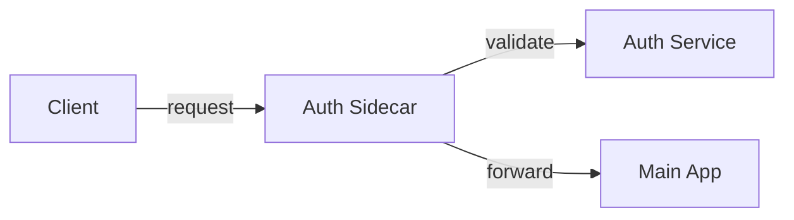

# 🚀 The Ultimate Guide to Sidecar Pattern

## 📚 Table of Contents
1. [Core Concept and Definition](#1-core-concept-and-definition)
2. [Common Use Cases](#2-common-use-cases)
3. [Architectural Components](#3-architectural-components)
4. [Implementation Guide](#4-implementation-guide)
5. [Real-World Examples](#5-real-world-examples)
6. [Advantages](#6-advantages)
7. [Challenges and Solutions](#7-challenges-and-solutions)
8. [Best Practices](#8-best-practices)
9. [Implementation Examples](#9-implementation-examples)

## 1. Core Concept and Definition 🎯
### What is the Sidecar Pattern? 
- A design pattern in distributed systems architecture
- Think of it as a helper container that supports your main application
- Like a motorcycle sidecar: main vehicle (primary service) + support unit (sidecar)

### Key Characteristics 🔑
1. **Co-location** 📍
   - Lives alongside the main application
   - Usually in the same Kubernetes pod
   - Shares the same lifecycle
   - Guaranteed proximity for performance

2. **Independence** 🔄
   - Loosely coupled architecture
   - Separate maintenance cycles
   - Independent scaling
   - Isolated failure domains

3. **Resource Sharing** 🤝
   - Common CPU pools
   - Shared memory space
   - Network interface sharing
   - Volume mounting capabilities

4. **Communication** 📡
   - Local network communication
   - Shared filesystem access
   - Inter-process communication
   - Service mesh integration

## 2. Common Use Cases 💡
### Logging and Monitoring 📊
- **Example**: Fluentd sidecar collecting application logs
```yaml
containers:
- name: app
  image: my-app:1.0
- name: logging-sidecar
  image: fluentd:v1.14
  volumeMounts:
  - name: log-volume
    mountPath: /var/log
```

### Security and Auth 🔒
- **SSL/TLS Termination**
- **OAuth Token Management**
- **Certificate Rotation**
- **Access Control**

### Configuration Management ⚙️
- Dynamic config updates
- Feature flag management
- Environment variable injection
- Secrets management

### Service Mesh Components 🕸️
- **Traffic Management**
- **Service Discovery**
- **Load Balancing**
- **Circuit Breaking**

## 3. Architectural Components 🏗️
### Primary Application Container 📦
- Business logic focus
- Core functionality
- Stateless/Stateful services
- Microservices components

### Sidecar Container 🔄
- Support functions
- Operational features
- Enhanced capabilities
- Infrastructure concerns

### Communication Layer 🔌
- HTTP/HTTPS
- Unix sockets
- Shared memory
- File system

## 4. Implementation Guide 📝
### Kubernetes Setup
```yaml
apiVersion: v1
kind: Pod
metadata:
  name: sidecar-example
spec:
  containers:
  - name: main-app
    image: main-app:1.0
    ports:
    - containerPort: 8080
  - name: sidecar
    image: sidecar:1.0
    volumeMounts:
    - name: shared-data
      mountPath: /data
  volumes:
  - name: shared-data
    emptyDir: {}
```

### Docker Compose Setup
```yaml
version: '3'
services:
  main-app:
    image: main-app:1.0
    ports:
      - "8080:8080"
  sidecar:
    image: sidecar:1.0
    volumes:
      - shared-data:/data
volumes:
  shared-data:
```

## 5. Real-World Examples 🌟
### 1. Logging Pipeline


### 2. Authentication System


### 3. Metrics Collection


## 6. Advantages 🎯
### Enhanced Modularity 🔄
- Clean separation of concerns
- Improved maintainability
- Better testing capabilities
- Reduced complexity

### Operational Benefits 🛠️
- Independent scaling
- Separate deployment cycles
- Isolated failures
- Easy updates

### Development Efficiency 👨‍💻
- Specialized teams
- Focused development
- Reusable components
- Faster iterations

## 7. Challenges and Solutions 🎯
### Resource Management 📊
**Challenge**: Resource contention
**Solution**: 
```yaml
resources:
  limits:
    cpu: "200m"
    memory: "256Mi"
  requests:
    cpu: "100m"
    memory: "128Mi"
```

### Debugging Complexity 🔍
**Challenge**: Multiple components to debug
**Solutions**:
- Unified logging
- Distributed tracing
- Health checks
- Metrics collection

### Security Concerns 🔒
**Challenge**: Increased attack surface
**Solutions**:
- Network policies
- RBAC configuration
- Secret management
- Security contexts

## 8. Best Practices 📋
### Design Guidelines ✍️
1. Keep sidecars lightweight
2. Define clear boundaries
3. Use health checks
4. Implement proper logging

### Security Checklist 🔐
- [ ] Network policies
- [ ] Resource limits
- [ ] Security contexts
- [ ] Secret management

### Performance Tips ⚡
- Minimize inter-container communication
- Use appropriate resource limits
- Implement caching when possible
- Monitor performance metrics

## 9. Implementation Examples 💻
### Logging Sidecar
```yaml
apiVersion: v1
kind: Pod
metadata:
  name: logging-example
spec:
  containers:
  - name: app
    image: my-app:1.0
    volumeMounts:
    - name: logs
      mountPath: /var/log
  - name: logging-sidecar
    image: fluentd:v1.14
    volumeMounts:
    - name: logs
      mountPath: /var/log
  volumes:
  - name: logs
    emptyDir: {}
```

### Authentication Sidecar
```yaml
apiVersion: v1
kind: Pod
metadata:
  name: auth-example
spec:
  containers:
  - name: app
    image: my-app:1.0
    ports:
    - containerPort: 8080
  - name: auth-sidecar
    image: oauth-proxy:1.0
    ports:
    - containerPort: 4180
```

### Metrics Sidecar
```yaml
apiVersion: v1
kind: Pod
metadata:
  name: metrics-example
spec:
  containers:
  - name: app
    image: my-app:1.0
  - name: prometheus-sidecar
    image: prom/prometheus:v2.30.3
    ports:
    - containerPort: 9090
```

## 📚 Additional Resources
- [Kubernetes Documentation](https://kubernetes.io/docs/concepts/workloads/pods/)
- [Docker Documentation](https://docs.docker.com/)
- [Service Mesh Documentation](https://istio.io/latest/docs/)
- [Envoy Proxy](https://www.envoyproxy.io/docs/envoy/latest/)

## 🔍 Troubleshooting Guide
### Common Issues
1. **Container Communication**
   - Check network policies
   - Verify port configurations
   - Validate service discovery

2. **Resource Constraints**
   - Monitor resource usage
   - Adjust limits and requests
   - Check for memory leaks

3. **Configuration Issues**
   - Validate ConfigMaps
   - Check environment variables
   - Verify volume mounts

### Debug Commands
```bash
# Check pod status
kubectl describe pod <pod-name>

# View logs
kubectl logs <pod-name> -c <container-name>

# Execute commands in container
kubectl exec -it <pod-name> -c <container-name> -- /bin/sh
```

## 🎯 Quick Reference
### Key Concepts
- Co-located containers
- Shared resources
- Independent lifecycle
- Operational separation

### Common Patterns
- Logging and monitoring
- Authentication and authorization
- Configuration management
- Service mesh integration

### Best Practices
- Resource management
- Security configuration
- Performance optimization
- Proper monitoring

This guide serves as a comprehensive reference for understanding and implementing the Sidecar Pattern in modern distributed systems. Remember to adapt these practices to your specific use case and requirements. 🚀